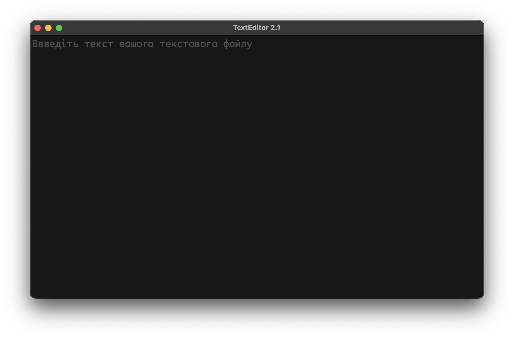

# TextEditor 2.1
# Що нового
     - Комбінації клавіш. Тепер доступні комбінації клавіш
     - Вибор формату файла при зберегенні
     - Виправлення помилок

# Комбінації клавіш

Command + o (на Windows Control + o): відкриття текстового файлу

Command + s (на Windows Control + s): збереження змін у відкритому файлі

Command + shift + s (на Windows Control + shift + s): збереження тексту користувача у файл

Command + l (на Windows Control + l): очищення редактору (але сам файл не очищається)

Command + f (на Windows Control + f): Вибір шрифта редактору (шрифт файлу не змінюється)

Command + shift + f (на Windows Control + shift + f): Встановлення шрифта за замовчюванням.

# Встановлення
### macOS
    1. Заходимо за посиланням https://github.com/Andboogl/TextEditor/releases/tag/%23release2.1
    2. Скачуємо файл TextEditor_2.1.zip
    3. Розпаковуємо архів

### Інші системи (Windows, Linux...)
    1. Встановлюємо Git
    2. Встановлюємо Python 3.12.0
    3. Вводимо у термінал команду git clone https://github.com/Andboogl/TextEditor.git
    4. Вводимо у термінал команду pip install pyqt6
    5. Запускаємо файл main.py та користуємося

# Демонстрація ПЗ

